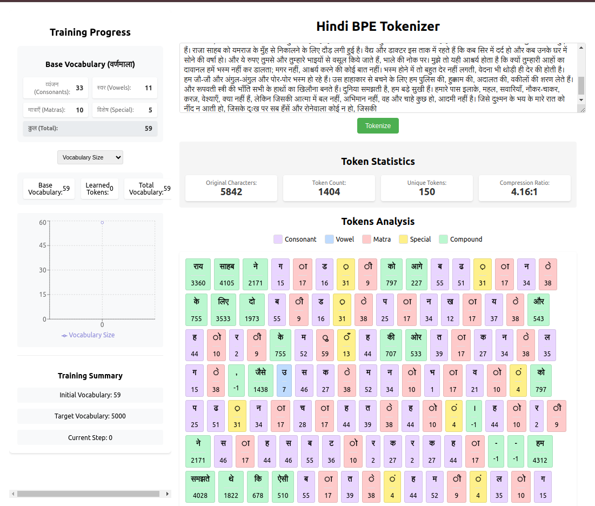

# Hindi Byte Pair Encoding (BPE) Implementation

This project implements Byte Pair Encoding (BPE) for Hindi text tokenization. The implementation includes both character-level and subword tokenization with a focus on handling Hindi script's unique characteristics.

## Core Components

### 1. Base Vocabulary (वर्णमाला)
The tokenizer starts with a base vocabulary consisting of:
- **व्यंजन (Consonants)**: क, ख, ग, घ, ङ, च, छ, ज, झ, ञ, etc.
- **स्वर (Vowels)**: अ, आ, इ, ई, उ, ऊ, ऋ, ए, ऐ, ओ, औ
- **मात्राएँ (Matras)**: ा, ि, ी, ु, ू, ृ, े, ै, ो, ौ
- **विशेष चिह्न (Special Characters)**:
  - Halant (विराम): ्
  - Anusvara (अनुस्वार): ं
  - Visarga (विसर्ग): ः
  - Chandrabindu (चन्द्रबिन्दु): ँ
  - Nukta (नुक्ता): ़

### Learned Vocabulary
Refer to `backend/bpe_model_latest.json` & `backend/token_frequencies.json`
### 2. BPE Training Process

#### 2.1 Data Preparation
1. **Text Collection**:
   - Downloads Hindi articles from Wikipedia
   - Cleans and preprocesses text (removes markup, references, etc.)
   - Splits into sentences

2. **Initial Tokenization**:
   - Splits text into words
   - Converts each word into space-separated characters
   - Creates initial frequency dictionary

#### 2.2 Learning Algorithm
1. **Initialization**:
   ```python
   vocab = base_vocabulary
   learned_vocab = set()
   merges = {}
   ```

2. **Training Loop**:
   ```python
   while len(vocab) < target_vocab_size:
       # Count pair frequencies
       pairs = get_pair_frequencies(word_freqs)
       if not pairs:
           break
           
       # Find most frequent pair
       best_pair = max(pairs.items(), key=lambda x: x[1])
       new_token = ''.join(best_pair[0])
       
       # Add to vocabulary
       vocab.add(new_token)
       learned_vocab.add(new_token)
       merges[best_pair] = new_token
       
       # Update word frequencies
       word_freqs = apply_merge(word_freqs, best_pair)
   ```

3. **Merge Operations**:
   - Finds most frequent adjacent character pairs
   - Merges them into a new token
   - Updates vocabulary and frequency counts
   - keep a track of all trained merges in merge_history
   - in regular interval revisit the vocabulary and update with the top 5000 from the tracked merges

### 3. Tokenization Process

#### 3.1 Character-level Tokenization
```

### 4. Token Analysis

#### 4.1 Token Types
- **Consonant**: Single consonant characters (व्यंजन)
- **Vowel**: Single vowel characters (स्वर)
- **Matra**: Vowel markers (मात्राएँ)
- **Special**: Special characters like halant, anusvara, etc.
- **Compound**: Learned tokens combining multiple characters

#### 4.2 Statistics Tracking
- Original character count
- Token count
- Unique tokens
- Compression ratio
- Token frequencies
- Merge frequencies

### 5. Metrics and Visualization

#### 5.1 Training Metrics
- Vocabulary size growth
- Learned vocabulary size
- Compression ratios
- Merge frequencies
- Unique token counts

#### 5.2 Token Analysis
- Token type distribution
- Token lengths
- Unicode representations
- Usage frequencies

## Implementation Details

### File Structure
```

### Key Classes

1. **HindiTokenizer**:
   - Manages base vocabulary
   - Handles character-level tokenization
   - Provides token type identification

2. **BPETokenizer**:
   - Inherits from HindiTokenizer
   - Implements BPE training algorithm
   - Handles subword tokenization
   - Tracks statistics and merge history

### API Endpoints

1. **POST /tokenize**:
   - Input: Hindi text
   - Output: 
     * Original and BPE tokens
     * Token statistics
     * Token details (type, length, Unicode)

2. **GET /vocabulary-stats**:
   - Returns:
     * Current vocabulary size
     * Most frequent tokens
     * Most frequent pairs

### Usage Example
```python
# Initialize tokenizer
tokenizer = BPETokenizer(vocab_size=10000)

# Train on text
tokenizer.learn_bpe(text)

# Tokenize text
result = tokenizer.tokenize_with_details("नमस्ते भारत")
print(result['bpe_tokens'])
```

## Performance Considerations

1. **Memory Usage**:
   - Stores full vocabulary in memory
   - Maintains frequency dictionaries
   - Tracks merge history

2. **Speed Optimizations**:
   - Uses sets for vocabulary lookups
   - Caches token types
   - Optimizes merge operations

3. **Training Efficiency**:
   - Stops when no frequent pairs remain
   - Uses frequency threshold for merges
   - Tracks progress with tqdm

## Future Improvements

1. **Tokenization**:
   - Handle numbers and English text better
   - Improve handling of Hindi conjuncts
   - Add support for rare character combinations

2. **Training**:
   - Add parallel processing for large datasets
   - Implement vocabulary pruning
   - Add support for incremental training

3. **Analysis**:
   - Add more detailed token statistics
   - Improve visualization of merge patterns
   - Add model comparison tools


### UI for the tokenizer
- Take content from any place with pure hindi articles.
- Tokenize the content
- it will show the original text, original tokens, bpe tokens, original encoded tokens, token numbers, stats, token details

UI Screenshot:

